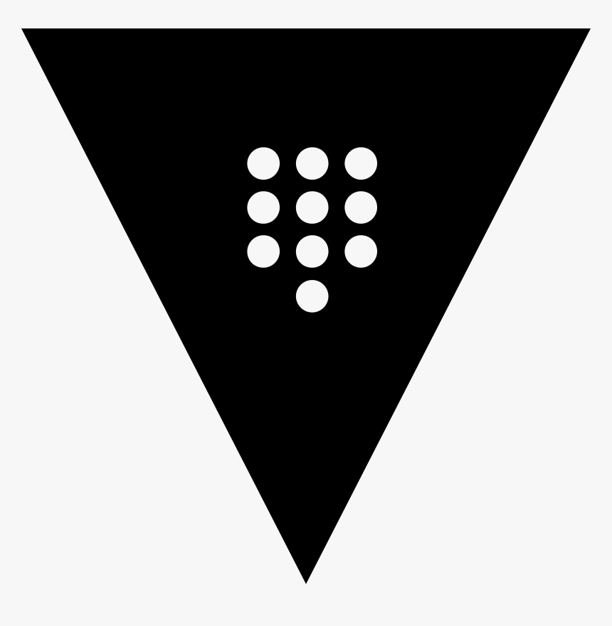
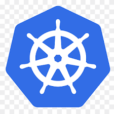
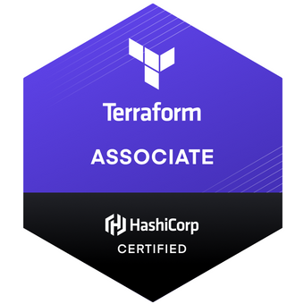
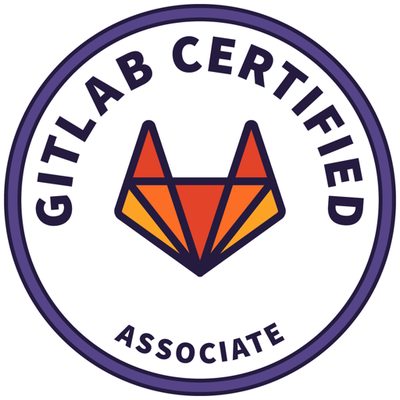

### Hello you all !!!

 I’m currently working at DevOps 

#### My goals
My goal is to learn, implement and achieve the best culture on DevOps and DevSecOps, helping to resolve problems.

#### My learning
At the moment i'm learning 
 the Hashicorp Stack and  
 Kubernetes.

##### Knowledge
AWS
Docker
Vault
K8S

#### Certifications
AWS CCP
Terraform Associate
GitLab Associate

#### Some Projects

- [RSSerNotion](https://github.com/felipehitomi/rssernotion)
- [DevSecOps Pìpeline](https://github.com/felipehitomi/DevSecOps-Pipeline)
